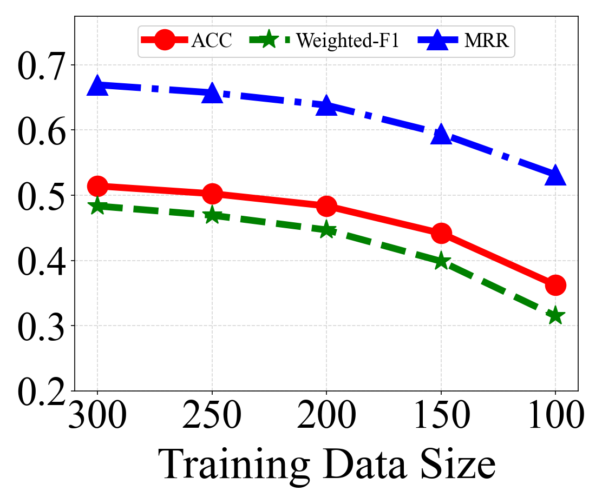
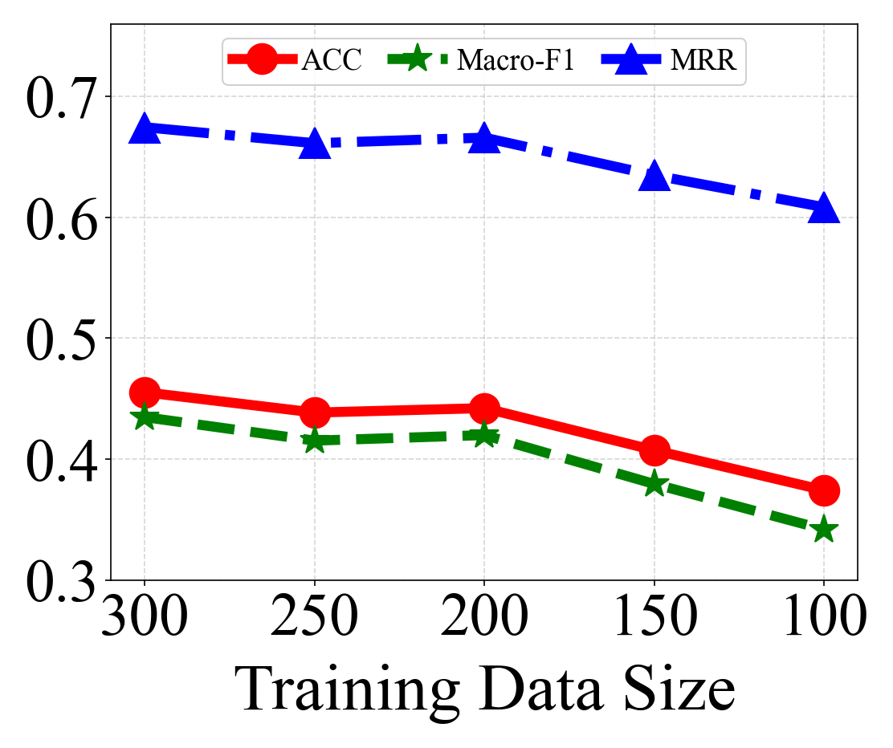
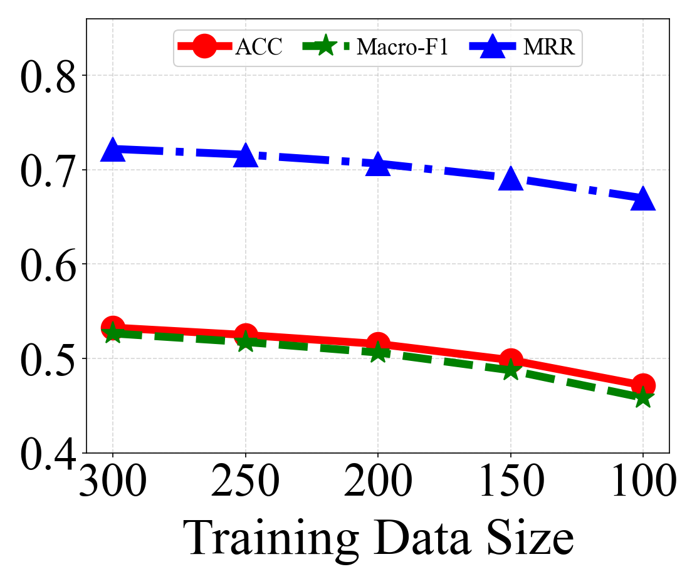
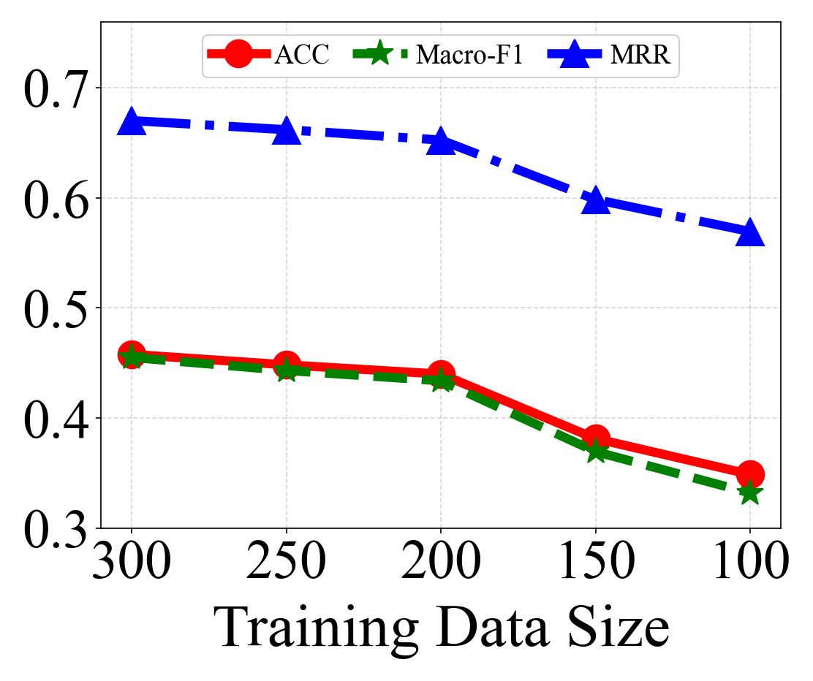
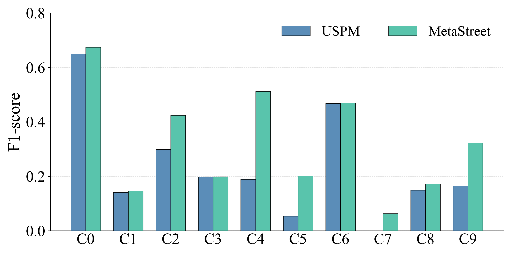
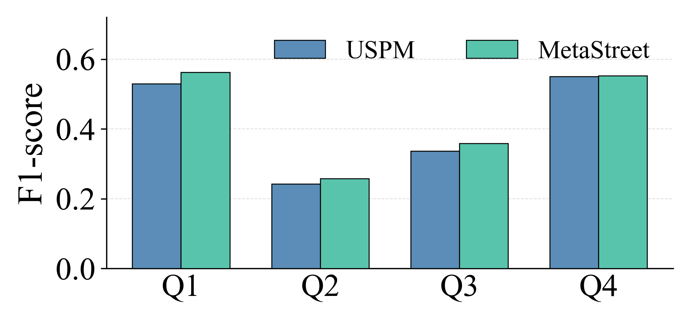

> ## W1 & Q1:

**Table 1: Per-class label distribution for street function prediction (Wuhan).**

| Class | Name | Count | Proportion |
|:---:|:---:|:---:|:---:|
| 0 | Residential | 2,546 | 46.6% |
| 1 | Business Office | 277 | 5.1% |
| 2 | Industry | 389 | 7.1% |
| 3 | Commercial Services | 419 | 7.7% |
| 4 | Transportation Stations | 45 | 0.8% |
| 5 | Administration | 166 | 3.0% |
| 6 | Education | 667 | 12.2% |
| 7 | Medical | 51 | 0.9% |
| 8 | Sports & Culture | 152 | 2.8% |
| 9 | Parks & Green Space | 746 | 13.7% |

**Table 2: Quartile-based label distribution for economic activity and house price prediction.**

| Task | Q1 | Q2 | Q3 | Q4 |
|:---:|:---:|:---:|:---:|:---:|
| Economic Activity (Wuhan) | 27.2% | 22.8% | 25.1% | 24.9% |
| Economic Activity (Xi'an) | 25.4% | 25.7% | 25.0% | 23.8% |
| House Price (Xi'an) | 25.0% | 25.3% | 25.0% | 24.7% |

> ## W4:

**Table 3: Comparison of adjacency matrix normalization strategies.**

|Task|Row Normalization|||Symmetric Normalization|||Raw counts (ours)|||
|-|:-:|:-:|:-:|:-:|:-:|:-:|:-:|:-:|:-:|
||ACC|F1†|MRR|ACC|F1†|MRR|ACC|F1†|MRR|
|Street Function Prediction (Wuhan)|44.83|39.29|61.79|48.25|39.48|64.54|**51.42**|**48.34**|**66.94**|
|Economic Activity Prediction (Wuhan)|41.38|39.32|64.62|42.17|39.86|64.93|**45.52**|**43.46**|**67.44**|
|Economic Activity Prediction (Xi'an)|38.43|38.28|62.92|39.65|37.54|63.08|**45.77**|**45.49**|**67.01**|
|House Price Prediction (Xi'an)|38.51|38.43|62.29|38.30|38.26|52.43|**53.26**|**52.64**|**72.19**|

† Weighted-F1 for Street Function; Macro-F1 for Economic Activity and House Price.

> ## W6 & Q3:

**Table 4: Prompt sensitivity and effect of segmentation statistics (Wuhan).**

|Variant|Street Function Prediction||||Economic Activity Prediction|||
|-|:-:|:-:|:-:|:-:|:-:|:-:|:-:|
||ACC@1|ACC@3|Weighted-F1|MRR|ACC|Macro-F1|MRR|
|Paraphrased prompt|50.47|76.63|47.41|65.93|**46.21**|**44.18**|67.03|
|No segmentation stats|51.02|76.50|47.68|66.01|44.78|43.21|66.18|
|**MetaStreet**|**51.42**|**77.52**|**48.34**|**66.94**|45.52|43.46|**67.44**|

**Table 5: Prompt sensitivity and effect of segmentation statistics (Xi'an).**

|Variant|House Price Prediction|||Economic Activity Prediction|||
|-|:-:|:-:|:-:|:-:|:-:|:-:|
||ACC|Macro-F1|MRR|ACC|Macro-F1|MRR|
|Paraphrased prompt|52.83|52.17|**72.46**|**46.05**|45.12|66.74|
|No segmentation stats|50.69|50.55|70.61|44.34|43.81|66.44|
|**MetaStreet**|**53.26**|**52.64**|72.19|45.77|**45.49**|**67.01**|

> ## W7:

**Table 6: Effect of the number of context streets *k* (Wuhan).**

|*k*|Street Function Prediction||||Economic Activity Prediction|||
|-|:-:|:-:|:-:|:-:|:-:|:-:|:-:|
||ACC@1|ACC@3|Weighted-F1|MRR|ACC|Macro-F1|MRR|
|3|48.31|74.55|45.97|64.21|44.31|42.16|66.21|
|**5 (ours)**|51.42|**77.52**|48.34|**66.94**|**45.52**|**43.46**|**67.44**|
|7|**51.44**|76.56|**48.52**|66.66|45.13|43.08|67.12|
|9|51.06|76.56|48.50|66.41|44.57|42.48|66.73|

**Table 7: Effect of the number of context streets *k* (Xi'an).**

|*k*|House Price Prediction|||Economic Activity Prediction|||
|-|:-:|:-:|:-:|:-:|:-:|:-:|
||ACC|Macro-F1|MRR|ACC|Macro-F1|MRR|
|3|48.66|48.01|68.88|43.37|42.61|65.46|
|**5 (ours)**|**53.26**|**52.64**|**72.19**|**45.77**|**45.49**|**67.01**|
|7|52.03|51.98|71.70|44.62|44.31|66.82|
|9|51.47|51.23|71.16|44.18|43.76|66.37|

> ## W8:

**Table 8: Standard deviations over 5 runs for MetaStreet and USPM.**

| Task | Method | ACC | F1† | MRR |
|:---:|:---:|:---:|:---:|:---:|
| Street Function Prediction (Wuhan) | USPM | 47.01 ± 0.55 | 44.04 ± 0.89 | 64.43 ± 0.62 |
| Street Function Prediction (Wuhan) | **MetaStreet** | **51.42** ± 0.63 | **48.34** ± 0.58 | **66.94** ± 0.47 |
| Economic Activity Prediction (Wuhan) | USPM | 43.69 ± 0.58 | 41.04 ± 0.66 | 66.02 ± 0.38 |
| Economic Activity Prediction (Wuhan) | **MetaStreet** | **45.52** ± 0.71 | **43.46** ± 0.49 | **67.44** ± 0.53 |
| Economic Activity Prediction (Xi'an) | USPM | 43.62 ± 0.73 | 43.22 ± 0.52 | 65.99 ± 0.47 |
| Economic Activity Prediction (Xi'an) | **MetaStreet** | **45.77** ± 0.44 | **45.49** ± 0.62 | **67.01** ± 0.51 |
| House Price Prediction (Xi'an) | USPM | 50.14 ± 0.48 | 50.27 ± 0.72 | 70.82 ± 0.35 |
| House Price Prediction (Xi'an) | **MetaStreet** | **53.26** ± 0.57 | **52.64** ± 0.41 | **72.19** ± 0.63 |

† Weighted-F1 for Street Function Prediction; Macro-F1 for Economic Activity Prediction and House Price Prediction.

>  ## W10:

**Figure 1: Performance under varying label sparsity (training size from 300 to 100).**

| | |
|:---:|:---:|
|  |  |
| (a) Street Function Prediction (Wuhan) | (b) Economic Activity Prediction (Wuhan) |
|  |  |
| (c) House Price Prediction (Xi'an) | (d) Economic Activity Prediction (Xi'an) |

**Figure 2: Per-class F1 scores for street function prediction (Wuhan).**

**Figure 3: Per-class F1 scores for economic activity prediction (Wuhan).**

